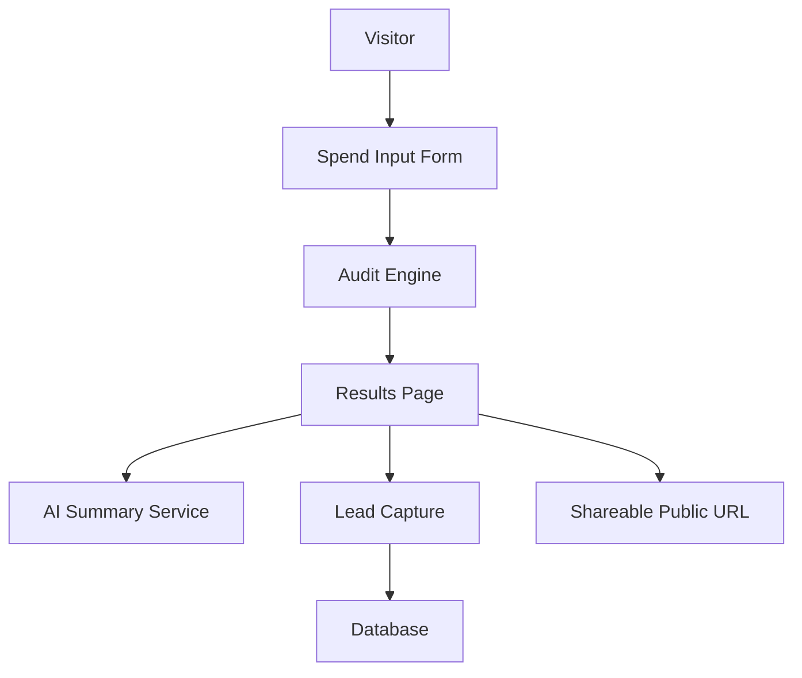

# Lucent Architecture

## System Diagram (Mermaid)

## Data Flow
1. User submits tool, plan, spend, seats, team size, and use case.
2. Audit engine calculates recommendations and savings.
3. Results page shows per-tool actions and total monthly/annual savings.
4. AI summary endpoint generates personalized paragraph with fallback behavior.
5. Lead capture stores user details in backend and sends confirmation email.
6. Public share URL renders a PII-stripped version of the report with OG metadata.

## Why This Stack
`TODO`

## What I’d Change for 10k Audits/Day
`TODO`

