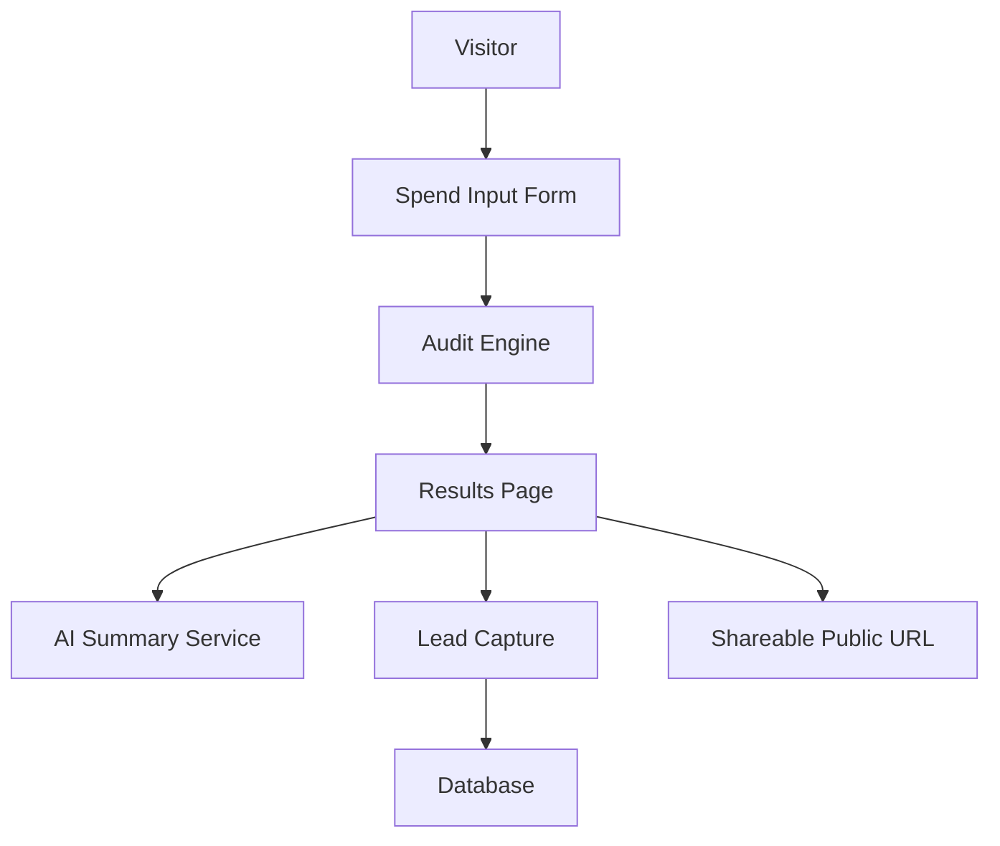

# Lucent Architecture

## System Diagram (Mermaid)

## Data Flow
1. User submits tool, plan, spend, seats, team size, and use case.
2. `POST /api/audit` validates input, runs audit engine, stores audit row, returns `id` and `public_id`.
3. Results page fetches audit payload by `id` and renders per-tool actions and total monthly/annual savings.
4. `POST /api/summary` generates personalized paragraph with fallback behavior.
5. `POST /api/lead` stores lead (linked by `audit_id`) and triggers confirmation email.
6. `GET /api/report/:publicId` returns public-safe report payload (no PII).
7. Public share URL renders PII-stripped report with OG metadata.

## Backend/API Plan
- `POST /api/audit` -> validate + compute + persist.
- `GET /api/audit/:id` -> private audit retrieval.
- `POST /api/lead` -> persist lead + send email.
- `POST /api/summary` -> LLM summary with fallback.
- `GET /api/report/:publicId` -> share-safe public report.

## Database Tables (MVP)
### `audits`
- `id` (uuid, pk)
- `public_id` (text, unique)
- `team_size` (int)
- `primary_use_case` (text)
- `total_monthly_spend` (numeric)
- `total_monthly_savings` (numeric)
- `total_annual_savings` (numeric)
- `audit_payload_json` (jsonb)
- `created_at` (timestamp)

### `leads`
- `id` (uuid, pk)
- `audit_id` (uuid, fk -> audits.id)
- `email` (text)
- `company_name` (text, nullable)
- `role` (text, nullable)
- `team_size` (int, nullable)
- `created_at` (timestamp)

### `events` (optional)
- `id` (uuid, pk)
- `audit_id` (uuid, nullable)
- `event_name` (text)
- `event_payload_json` (jsonb)
- `created_at` (timestamp)

## Why This Stack
- **Next.js (App Router, TypeScript)**: Single-repo setup simplifies routing, API handlers, and React frontend code. Next.js Server Components enable server-side database querying and SEO dynamic metadata compilation seamlessly, while TypeScript prevents runtime type inconsistencies.
- **Supabase**: Fully managed PostgreSQL service with a direct API footprint. Allows schema evolution, rapid relational data querying, and bypasses local DB infrastructure maintenance.
- **Tailwind CSS & Vanilla CSS**: Delivers responsive UI components without bloated bundle sizes. Keeps visual styles coherent.
- **Resend**: A developer-friendly SMTP transactional mail service with simple REST APIs, providing immediate confirmation emails to captured leads.
- **Vitest**: Lightweight test-runner that compiles TypeScript test specs without setup overhead, executing in under 1.5 seconds.

## What I’d Change for 10k Audits/Day
- **Redis Caching**: Deploy an Upstash or local Redis instance to cache public report responses (`/api/report/[publicId]`), bypassing database queries for read-heavy public views.
- **Message Queue for Asynchronous Operations**: Offload Resend transactional email deliveries and AI summary API requests to a Redis-backed queue (e.g., BullMQ or AWS SQS) to keep Next.js HTTP responses immediate and prevent Vercel Serverless timeout limits.
- **Rate-Limiting at the Edge**: Implement Cloudflare Edge rules or Next.js Middleware with Upstash rate-limiters on public-facing endpoints (`POST /api/audit`, `POST /api/summary`, and `POST /api/lead`) to prevent API abuse.
- **PostgreSQL Connection Pooling**: Enable PgBouncer or Supabase connection pooling to avoid exhausting DB connection pools during concurrent execution spikes.
- **On-the-Fly Dynamic Open Graph Generation**: Utilize `@vercel/og` (Satori) to dynamically construct meta-image cards on the server using the audit's actual savings data (e.g., displaying a personalized graph showing "$Y/year saved" in social cards).
