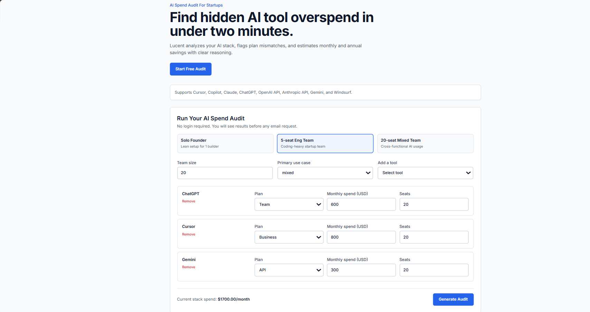
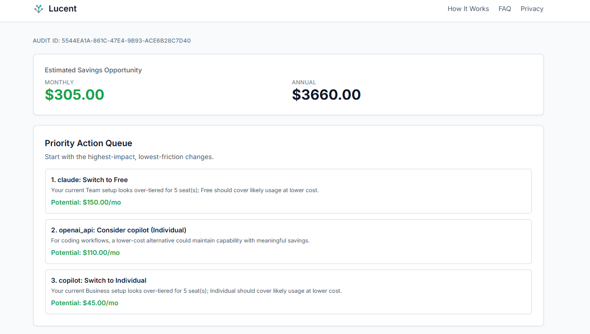
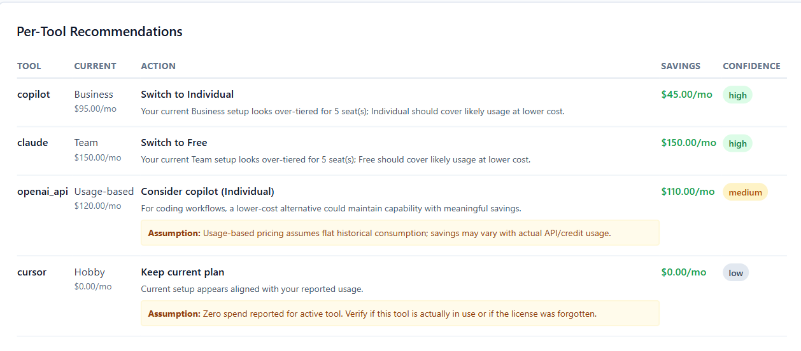
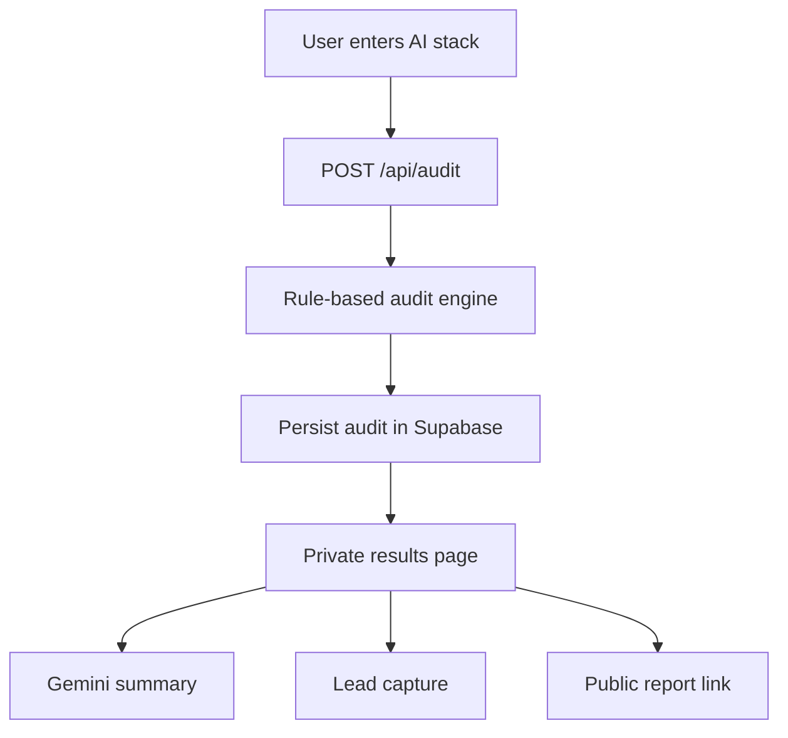

# Lucent

Lucent is a free, no-login AI spend audit platform for startup founders, CTOs, and engineering managers. Users enter their AI tool stack, run a two-minute audit, and receive a shareable report with deterministic savings recommendations plus an AI-written summary.

[Live Demo](https://lucent-rose.vercel.app)

## Deployed Site Screenshots

### Homepage audit form


### Audit results overview


### Per-tool recommendations


## Decisions

1. **Single repo Next.js architecture:** Kept the  frontend,API routes and deployment in one project.
2. **Rule-based audit logic:** Cost recommendations are purely mathematical without AI generated Output to prevent Hallucinations and misappropriate results.
3. **AI only for summary copy:** For Demo usage using Gemini Free API improve readability,while core savings math stays outside the LLM.
4. **Post-value lead capture:** Users sees the result before inputing the email to capture the main focal and MVP of the website.
5. **PII-safe public reports:** shared report only share the saving and recommendation and not the email/personal information.

## Features

- **Instant AI spend audit:** captures tools, plans, seats, spend, team size, and primary use case.
- **Deterministic audit engine:** savings math is rule-based and testable, not LLM-generated.
- **AI summary:** Gemini writes a concise personalized summary on top of computed audit results.
- **Lead capture after value:** email is requested only after the user sees the report.
- **Shareable public report:** `/r/[publicId]` strips identifying details and keeps the output safe to share.
- **Confidence and priority signals:** recommendations include confidence labels and a top-action queue.

## Quick Start

### Install

```bash
npm install
```

### Configure Environment

Create `.env` from `.env.example` and add the required keys:

```bash
cp .env.example .env
```

Required for the full app flow:

- `NEXT_PUBLIC_APP_URL`
- `NEXT_PUBLIC_SUPABASE_URL`
- `NEXT_PUBLIC_SUPABASE_ANON_KEY`
- `SUPABASE_SERVICE_ROLE_KEY`
- `GEMINI_API_KEY`
- `GEMINI_MODEL`
- `RESEND_API_KEY`
- `RESEND_FROM_EMAIL`

### Run Locally

```bash
npm run dev
```

Open [http://localhost:3000](http://localhost:3000).

### Test and Build

```bash
npm run lint
npm run test
npm run build
```

### Deploy

1. Import the GitHub repository into Vercel.
2. Add all environment variables from `.env.example`.
3. Apply the Supabase SQL migration in `supabase/migrations`.
4. Verify the flow: `/` -> `/audit/[id]` -> `/r/[publicId]`.

## Tech Stack

| Layer | Technology |
| --- | --- |
| Framework | Next.js App Router |
| Language | TypeScript |
| Styling | Tailwind CSS |
| Database | Supabase Postgres |
| AI Provider | Google Gemini API |
| Email | Resend |
| Hosting | Vercel |
| Validation | Zod |
| Testing | Vitest |


## Core Audit Flow



## Available Scripts

| Command | Description |
| --- | --- |
| `npm run dev` | Start local development server |
| `npm run build` | Build production app |
| `npm run start` | Start production server |
| `npm run lint` | Run ESLint |
| `npm run test` | Run Vitest |

## Deployed URL

https://lucent-rose.vercel.app

